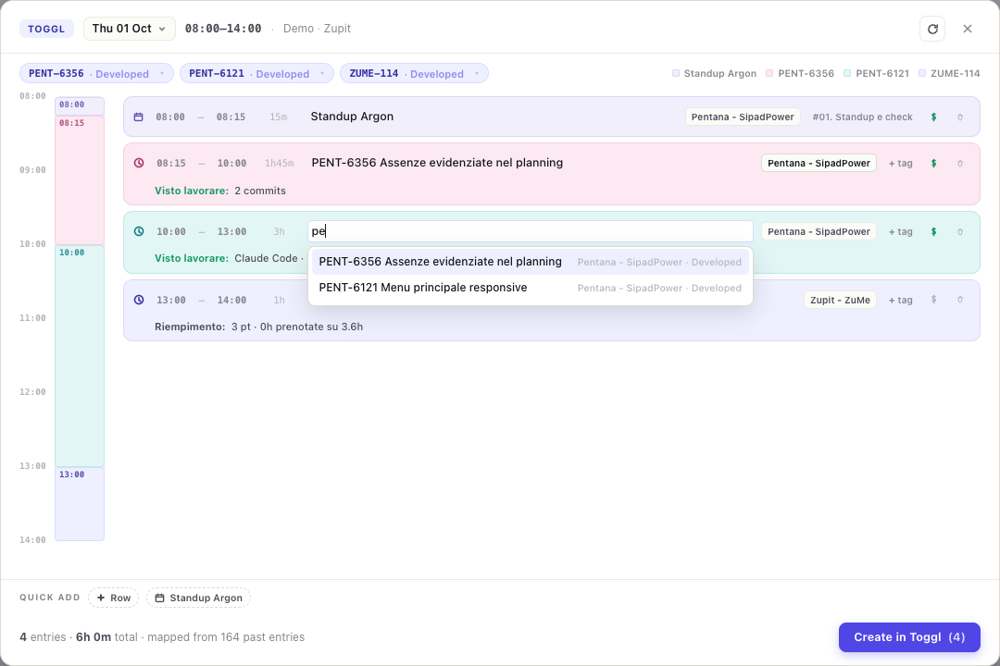
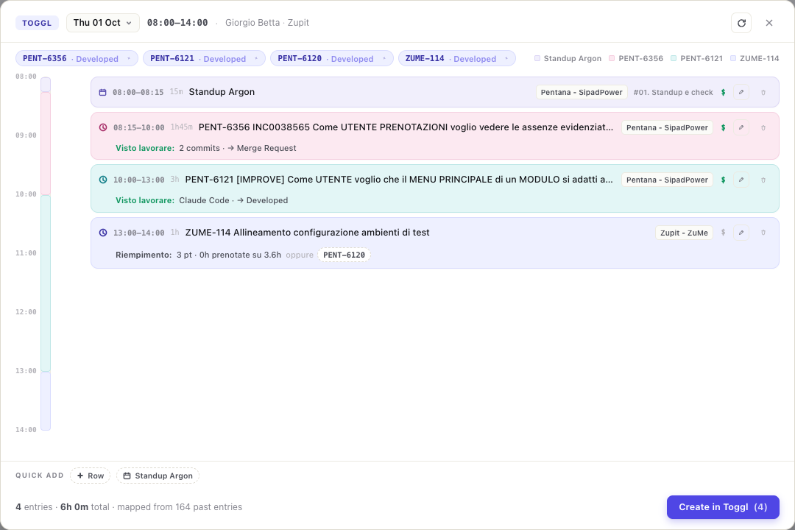
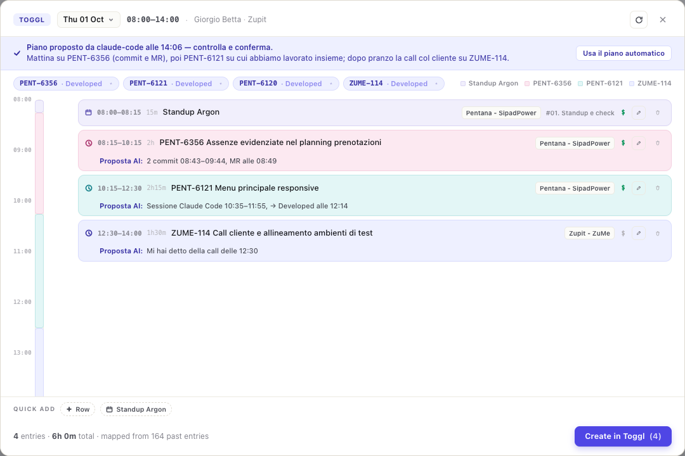

# Changelog

All notable changes to ZuGit are documented here.  
Format follows [Keep a Changelog](https://keepachangelog.com/en/1.1.0/).

---

## [Unreleased]

### Added
- **Toggl planner: the Zupit bot's checks, before you submit** — every row is checked against the
  rules of the morning Toggl bot (same order, same story-id pattern) and shows what it would flag
  on Slack, with the same emoji: a storyless tag next to a story id (🚫), billable on a project or
  non-billable on Zupit (💰 0️⃣), tags on Zupit entries (🟦), no story id and no tag (🏷️), pair
  programming without a story (🟢), a description that is only the key (👔), a missing project (👷),
  T&M or SPIKE work off the client's T&M project (🧱). Each line carries its fix, and **Applica
  suggerimenti** in the footer applies every fix that is certain, on all rows at once. Two more
  hints the bot does not raise: a story key booked on a project other than the one history uses for
  it (🔀), and several stories in one entry (🧩) — the bot only reads the first key — with **Dividi**
  (one row per story, time shared on the grid) or **Lavoro di sprint** (no keys, tag 02).

### Changed
- **Toggl planner: no story bar** — the row of active stories and the colour legend above the plan
  are gone: adding a row for a story is what **+ Row** or a click on free time already does, with
  the stories first in the suggestions. Those suggestions now list every active story, not the
  first eight.
- **MCP connector: one story per entry** — the assistant is told to never list several Jira keys in
  one entry, to book sprint-wide work (planning, analysis, estimates) with a tag and no key, and to
  put no tag on a story entry except pair programming, team support and code review.

---

## [1.0.2] - 2026-10-02

---

## [1.0.1] - 2026-10-01

### Added
- **Toggl planner: edit in place, like a calendar** — the timeline is now draggable: move a block,
  resize it from its top or bottom edge, drag the seam between two touching blocks to move the
  boundary (the next row follows, so the day keeps no hole and no overlap; hold Alt to move one edge
  alone), click free time to add a row covering exactly that gap. The same seam sits between
  touching cards. No more pencil: times and length are always editable — ↑ ↓ for ±15 minutes
  (Shift: ±1 hour), or type `930`, `9:30`, `+45m`, `1h30`. The description suggests today's stories
  and what you booked before, and picking one — or just typing a Jira key — fills project, tag and
  billable from your history. Project and tag open a searchable picker, most used first.

  
- **MCP connector: see whether it is set up** — Settings → Connettore MCP now shows, next to each
  command, whether Claude Code, Codex and Claude Desktop run this ZuGit: connected, not connected, or
  pointing at a ZuGit that is gone (app moved or reinstalled) or at another copy (a dev build), with
  what to change. ZuGit only reads their config files; registering stays copy and paste.
- **Release status: compare against a release branch** — next to the version, pick the branch the
  release is checked against: `main` (the default) or any branch starting with the new **Release
  branch prefix** setting (Settings → Jira, `release` out of the box). On a release branch the window
  starts at that branch's latest tag, only PRs based on it count, and the commits since the tag are
  read too, so a cherry-pick pushed without a PR still marks its story as merged (linked to the
  original PR, or to the commit). A Verified or Done story is no longer assumed to be there: with no
  matching PR or commit it stays Missing, flagged "Jira ahead of git" — the cherry-pick still to do.
  The branch picked is remembered per release.

### Changed
- **Settings: compact, collapsible sections** — the settings page is grouped into Connections,
  Dashboard features, Time tracking and General, and every section folds down to one line showing its
  state (Configured / Needs setup, On / Off). Open only the one you need, or use Expand all /
  Collapse all; ZuGit remembers which ones you left open. A dot marks sections with unsaved edits,
  and a field that fails validation opens its section on save.

### Fixed
- **Toggl planner: merging someone else's MR is not your work** — moving a story to Developed (or
  any status past merge request) counted as the end of an hour of work on it, even when you had only
  reviewed and merged a colleague's MR. Such a move now counts in full only if you also have commits
  or AI sessions on that story the same day; otherwise it barely weighs ("senza tuoi commit o
  sessioni"). Moves to Merge Request, your own hand-off, are unchanged.
- **PR list: stories stuck in their old release** — Jira data was cached for the whole session and
  only re-read for keys never seen before, so a story moved to another fix version on Jira kept being
  grouped under the old one until the cache happened to be cleared (settings saved, release diff
  opened, or the 12-hour maintenance). Every refresh now re-reads all linked tickets; the cache is
  only a fallback for tickets Jira could not return that time.
- **Release status: "Since" tag disappearing** — the tag the diff starts from vanished as soon as
  the list re-rendered (right after opening, on every tab switch). It now stays next to the tabs.

---

## [1.0.0] - 2026-10-01

---

## [1.0.0-beta1] - 2026-10-01

---

## [1.0.0.beta1] - 2026-10-01

---

## [0.12.0] - 2026-08-13

### Added
- **Toggl: evidence of what you actually worked on** — besides the stories in progress or in merge
  request, the planner now counts the stories you moved yourself during the day (into any status,
  *Developed* included), your commits on every branch of the repositories you work in (unpushed ones
  too) and your Claude Code / Codex sessions, whose git branch names the story. Jira moves made in
  the same minute share their weight. Local sources can be switched off in **Settings → Toggl →
  Activity**; only official projects count, experimental branches are ignored.
- **Toggl: proportional split** — free time is shared by evidence instead of cutting every gap in
  half: contiguous blocks of at least an hour, each with its reason (*Visto lavorare*, *Stima da
  Jira*, *Riempimento*) and the other plausible stories as one-click swaps.

  

- **Toggl: gap filling** (optional, **Settings → Toggl → Gap filling**) — time no evidence explains
  goes to the open sprint's stories in proportion to what their estimate still leaves unbooked:
  story points × your pace (median minutes per point, learned from your Toggl history) minus what is
  already booked. Stories without points count as one and never drop to zero.
- **Toggl: calendar memory** — what you book for a meeting is remembered per recurring series and per
  title, and past meetings are matched with the entries that overlapped them, so a recurring meeting
  comes pre-filled even when it was booked under a different name.
- **MCP connector** — `zugit --mcp` serves the Model Context Protocol, so Claude Code, Claude Desktop
  or Codex can read a Toggl day (`toggl_get_day`), read booked entries (`toggl_get_entries`) and
  propose a plan (`toggl_propose_day`, prompt `fill_toggl_day`). Credentials stay in the keychain.
  Proposals are never written to Toggl: the planner opens on them (or swaps them in when already
  open) and the user confirms; unconfirmed ones for other days are listed, and dropped after a week.
  Setup commands in **Settings → Assistenti AI**.

  
- **Release notes: manual include / exclude** — every story in the release diff now carries a control
  in its last column showing whether it will end up in the notes. Clicking it offers **Include
  anyway** / **Exclude anyway** / **Auto (default)**, so a Missing story that shipped anyway can be
  announced and a Done one can be kept quiet. The automatic rule (only *Done* goes in) still applies
  to everything left on *Auto*. Decisions are stored per release in `release-notes.json` and survive
  a refresh, a version switch and a restart.
- **Release notes grouped by epic** — the notes panel groups by **Type** or by **Epic**. Both keep
  the POWER / BUG headings on top; Epic adds a per-epic section under each of them, read from Jira's
  *Principale* field — resolved by name at runtime, falling back to the built-in `parent` field —
  with stories without an epic grouped last. Grouping defaults to Epic when the release carries epic
  data. Each row also shows its epic next to the branch.

### Fixed
- **Toggl: old stories in the plan** — with nothing active in the open sprint, the planner fell back to
  every story ever assigned in *In Progress* / *Merge Request*, resurrecting months-old ones. It now
  falls back only when the sprint holds nothing of yours at all, and then only to stories updated in
  the last 14 days.
- **Toggl: recurring meetings forgotten** — the weekly relearn dropped meetings booked once, and
  meetings were matched on the description you typed rather than on the event, so next week's
  occurrence came up without a project. Accented titles never matched at all.
---

## [0.11.2] - 2026-08-12

- **"Orphan branches" is now "Stale branches"** — in Git an *orphan branch* is one created with
  `git checkout --orphan`, with no shared history: a different thing from a branch nobody has touched
  in months. *Stale* is both accurate and the term GitHub and Bitbucket use for exactly these
  branches, and it already matched the **Stale after (days)** setting. The tab, the settings card and
  the stored keys were renamed; the old setting keys are still read, so an existing configuration
  survives the upgrade untouched.

---

## [0.11.1] - 2026-08-11

---

## [0.11.0] - 2026-08-11

---

## [0.10.2] - 2026-07-31

### Added
- **Orphan branches** — a tab (off by default, enable it in **Settings → Orphan branches**) listing
  the remote branches with no open PR that nobody has pushed to for more than N days, 15 by default.
  The scan skips the default branch, protected branches, anything that is the head or the base of an
  open PR, and any name starting with one of the configurable **ignored prefixes** (`release` by
  default). What is left is sorted ascending by last commit, most stale first, and can be grouped by
  author — one section per person, ordered by who owns the oldest branch. A filter switches between
  **Only mine** — branches whose last commit is yours, the only ownership GitHub records for a ref —
  and **Everyone**, and two more filter by author type: **Internal** (on by default; the internal
  marker or the team list) and **Collaborator** (everyone else, unlinked commits included). It is read-only: rows open the branch on GitHub, ZuGit never deletes anything.
  The scan follows the toolbar's repository selector, like the PR list does, and reruns when that
  selection changes. Walking every branch of every repository is expensive, so it runs when the tab
  is opened or **Rescan** is pressed, never on the auto-refresh.
- **End-of-day Toggl reminder** — when the working range is over, a native notification ("Ricordati
  di compilare Toggl") and the planner open for a check. Once a day, working days only, and only
  when Toggl is configured; it never reopens over a planner already on screen.

### Changed
- **The Toggl button only appears once the integration is configured** — it used to show as soon as
  the checkbox was ticked, so it could open a panel that had no token to work with.

---

## [0.10.1] - 2026-07-30

---

## [0.10.0] - 2026-07-30

### Security
- **macOS keychain writes no longer expose secrets in the process list** — tokens were passed to
  `security add-generic-password` as `-w <value>`, and process arguments are readable by any other
  process of the same user for as long as the command runs. Writes now go through `security -i`,
  which takes the whole command on stdin, with the value hex-encoded: the secret never reaches
  `argv`, hex avoids interactive mode's space-splitting, and there is no length cap — prompting for
  the value would have been simpler but `readpassphrase(3)` truncates at 128 characters, half an
  Atlassian API token. Every write is verified by reading it back, and non-ASCII values are refused
  rather than stored in a form that cannot be read again. Affects the GitHub and Jira tokens too,
  not just the ones added in this release.

### Changed
- **Toggl day planner redesigned** — the day is now a timeline: a rail on the left maps the whole
  working range, and each entry is a compact card next to it, colour-coded by task and highlighted
  in both places on hover. Entries already on Toggl are interleaved in place as locked rows instead
  of sitting in a separate list, confident rows collapse to one line and expand only when you click
  edit, and the rows that need an answer (ambiguous, overlapping, rejected) are the ones that stand
  out. An ambiguous slot now starts empty rather than pre-filled with a guess, so a straight-through
  confirm can no longer book a story you never chose.
- **Update notes before installing** — clicking the update badge opens the release notes published
  with the incoming version, with Install and Later, instead of restarting the app on a single
  click. The **What's new** modal stays hand-curated in `src/changelog.ts` and is deliberately not
  generated from this file: it is what a user should read about a release, not the full record.
- **Days with nothing In Progress are filled too** — the planner left a slot blank when no story's
  activity window covered it, which is exactly what happens when the only story of the day moved to
  merge request in the morning: the afternoon came out empty. Uncovered slots now fall back to the
  story worked on immediately before them (or the next one picked up, if the gap is at the start).
- **Distinct colours per task in the Toggl planner** — task colours were hashed independently, so
  with three stories in a day two of them shared a tone better than half the time. A colour is now
  claimed once per task and collisions walk to the next free tone, while a row with no story and no
  description keeps the neutral grey instead of being handed a random colour.

### Fixed
- **Backend errors reached the user as "Unable to save settings"** — Tauri rejects with the plain
  string a command returned, not with an `Error`, so every `instanceof Error` check in the frontend
  failed and the real reason was replaced by a generic message. All 19 call sites now go through one
  helper, and the credential-store failures say which secret failed and why.

### Added
- **Toggl timesheet autofill** (opt-in, Settings → Toggl) — a **Toggl** button in the toolbar opens a
  day planner that fills the free slots of your working range (default 08:00–14:00) with the Jira
  stories assigned to you in *In Progress* or in the merge-request status. Slots already booked on
  Toggl are skipped, so the calendar events you accepted there are preserved and a second run
  proposes nothing. The moment a story entered its status (read from the Jira changelog) splits the
  day: the story you moved to merge request at 10:30 gets the morning, the one you picked up then
  gets the afternoon. Only stories in the open sprint are considered. When two stories are equally
  plausible the row asks which one to track, or splits the slot equally between them on request.
  Project and tags are learned from your own Toggl history (Jira key → project, key prefix →
  project, recurring meetings → project + tags), and manual choices are folded back into the rules.
  Nothing is written until you confirm. The integration only creates entries — it never edits or
  deletes existing ones — and can only write to today or the previous 7 days.
- **Google Calendar import** (opt-in, Settings → Google Calendar) — meetings in the working range
  become rows of their own and claim their slots before the stories are placed, with project, tags
  and billable flag taken from the matching recurring rule. Declined, all-day, free-marked and
  already-tracked events are ignored. Read-only scope, OAuth with PKCE on a loopback redirect; only
  the refresh token is stored, in the system keychain.

---

## [0.9.7] - 2026-06-30

---

## [0.9.6] - 2026-06-09

- **Warning about expired tokens** 
- **Multi-release stories** — a story/PR can now belong to several Jira fix versions at once.
  The dashboard groups it under its primary (most imminent) release with a `+N release` badge
  listing the others, the release-diff classifies it correctly (Done/Missing instead of Extra)
  when any of its versions matches the release, and Move/Defer/Adopt/Drop act only on the current
  release — preserving the story's other version assignments instead of overwriting them.

## [0.9.5] - 2026-05-28

---

## [0.9.4] - 2026-05-28

### Added
- **Add reviewer from the dashboard** — each PR row now has a **+** button next to the reviewer
  badges. Click it to pick any team member not already reviewing; they get added instantly without
  leaving the dashboard.

---

## [0.9.3] - 2026-05-26

---

## [0.9.2] - 2026-05-25

---

## [0.9.1] - 2026-05-21

---

## [0.9.0] - 2026-05-21

### Added
- **My Reaction Score** — personal-only score widget (0–100) in the Review Load bar strip.
  Shows how quickly the current user is reacting to pending reviews, CI failures, merge conflicts,
  and changes-requested on their PRs. Hover the pill for a breakdown of active penalties.
  See `docs/reaction-score.md` for the full scoring model.

- **My Score settings card** — dedicated Settings card to enable/disable the score widget and
  toggle each scoring rule independently (review requests, changes requested, CI failures,
  branch behind/conflicting). Includes a legend with activation thresholds and penalty weights.
  *Branch behind / conflicting* is disabled by default.

- **Release diff — last tag on default branch** — the release diff now resolves the last tag
  strictly on `defaultBranchRef` (main), so hotfix or side-branch tags no longer skew the
  "merged since last release" boundary. The resolved tag is displayed in the tab bar as
  **Since: vX.Y.Z**.

- **Release notes PREVIEW badge** — stories in the Done tab that are not yet in *Verified*
  status on Jira are marked with a `` `PREVIEW` `` badge in the generated release notes.

- **Daily maintenance** — on startup (if >12 h since last run) and every 12 h while the app
  is open, ZuGit automatically invalidates the Jira cache and checks for a new app version.

---

## [0.8.4] - 2026-05-14

---

## [0.8.3] - 2026-05-14

---

## [0.8.2] - 2026-05-14

---

## [0.8.1] - 2026-05-14

---

## [0.8.0] - 2026-05-12

---

## [0.6.3] - 2026-05-09

---

## [0.6.2] - 2026-05-09

### Added

**Features**

- **What's new modal** — shows automatically after an app update (version-gated via localStorage). Can be reopened at any time from the "What's new" entry in the nav. Entries support images, HTML, and numbered steps.

- **Branch diff stats in New PR card** — additions, deletions, file count, and a collapsible commit list with relative timestamps. Fetched via `GET /repos/{repo}/compare/{base}...{head}`.

- **Auto-merge chip** — inline chip on PR rows showing when auto-merge is enabled on a PR, with the configured merge method.

- **Promote spinner** — the Promote button shows a loading state while diff stats are fetched; the card opens only when all data is ready.

**Internal**

- **Add PR — branch detection via GitHub Activity API**  
  The "Add PR" button now reliably finds your unpublished branch even when your git commit email is not verified on GitHub. The previous approach used `GET /repos/{repo}/commits?author={login}`, which matches by git commit email and silently returns nothing when the email is not associated with the GitHub account. The new approach uses `GET /repos/{repo}/activity?actor={login}&activity_type=push`, which matches by GitHub account identity regardless of the configured git email. See [`docs/github-identity.md`](docs/github-identity.md) for a detailed explanation.

- **ESLint** configured for the TypeScript frontend (`eslint.config.js`).  
  Rules: `no-explicit-any` (warn), `no-unused-vars` (warn), `no-non-null-assertion` (warn), `no-console` (warn), `eqeqeq` (error).

- **CI check job** added to `.github/workflows/build.yml`.  
  Runs TypeScript type check (`tsc --noEmit`) and `cargo clippy -- -D warnings` on Ubuntu before the platform matrix build starts. Errors in types or Rust lints now fail the build immediately instead of surfacing only at runtime.

- **CSP enabled** in `tauri.conf.json`.  
  Changed from `null` (disabled) to a minimal policy:  
  `default-src 'self'; script-src 'self'; style-src 'self' 'unsafe-inline'; img-src 'self' https://avatars.githubusercontent.com data: blob:`  
  This blocks injection of external scripts while allowing inline styles (used throughout the HTML templates) and GitHub avatar images.

### Changed

**Features**

- **PR row right padding** made symmetric with left (18px both sides).

**Internal**

- **New PR branch detection overhauled** — reduced from 6+ round trips to 4. Round trip 1 now also fetches all open PR head refs per repo in the same batched GraphQL query, so branches that already have an open PR (including drafts) are excluded immediately without waiting for the candidate check in round trip 3.

- **`pr_cache` removed** — the `Mutex<HashMap<String, CachedPrDetails>>` cache in `AppState` was serving no purpose since a single GraphQL query already fetches all PR data fresh on every refresh. Removing it eliminates a source of stale data bugs (e.g. auto-merge not showing after being enabled).

- **Jira logs reduced** — removed all info/debug `eprintln!` from `jira.rs`; only errors are logged.

- **Frontend split into modules** (`src/main.ts` 1800 lines → 7 focused files):

  | File | Responsibility |
  |------|---------------|
  | `src/state.ts` | Single mutable state object shared across modules |
  | `src/utils.ts` | Pure helpers: `escHtml`, `avatarSm`, `SVG`, `chip`, `relativeTime`, `PRIORITY_RANK`, etc. |
  | `src/filters.ts` | List filter/sort logic: `applyListFilters`, notification counters |
  | `src/render.ts` | All `render*` functions, DOM helpers, notifications |
  | `src/api.ts` | Tauri `invoke` wrappers: `bootstrap`, `refreshDashboard`, `saveSettingsAndRefresh`, etc. |
  | `src/draft-pr.ts` | Add PR card component: render, load, publish |
  | `src/main.ts` | `DOMContentLoaded` bootstrap and event delegation only |

  Dependency order is linear (no cycles): `utils ← filters ← render ← api ← draft-pr ← main`.

- **Mutex poisoning eliminated** across all Rust modules.  
  Migrated from `std::sync::Mutex` to `parking_lot::Mutex` in `github.rs`, `jira.rs`, `lib.rs`, `dashboard.rs`, and `commands.rs`. `parking_lot::Mutex::lock()` returns the guard directly (no `Result`, no poisoning), removing all `.unwrap()` calls on lock acquisition.

- **`docs/github-identity.md`** added: detailed write-up on the difference between git author identity and GitHub account identity, and why the Activity API is the correct approach.

### Fixed

- **Memory leak in reviewer picker**: the `document.addEventListener("click", …)` that closes the picker was being added inside `renderDraftPrCard()` on every re-render. Moved to a setup-once call in `DOMContentLoaded`.

- **Race condition in `refreshDashboard`**: concurrent calls could both pass the `refreshInProgress` guard before the flag was set, or a slow response could overwrite a newer one. Fixed with a monotonic `refreshRequestId`; stale responses are silently discarded.

- **XSS-class rendering bug**: `pr.title`, `pr.author`, and reviewer logins were inserted into `innerHTML` templates without escaping. Wrapped with `escHtml()` throughout `renderPRRow` and `renderDraftPrCard`.

- **`open_external` URL validation**: the Tauri command now rejects any URL that does not start with `http://` or `https://`, preventing arbitrary scheme invocations from the frontend.

- **Duplicate `@keyframes spin`** in `src/index.css`: three identical definitions existed; reduced to one.

- **Debug `eprintln!` statements** removed from `commands.rs` and `github.rs` (left over from branch-detection debugging). They were leaking repo names and branch names to stderr in production builds.

---

## [0.4.4] — 2025

_Previous release. See git history for details._
