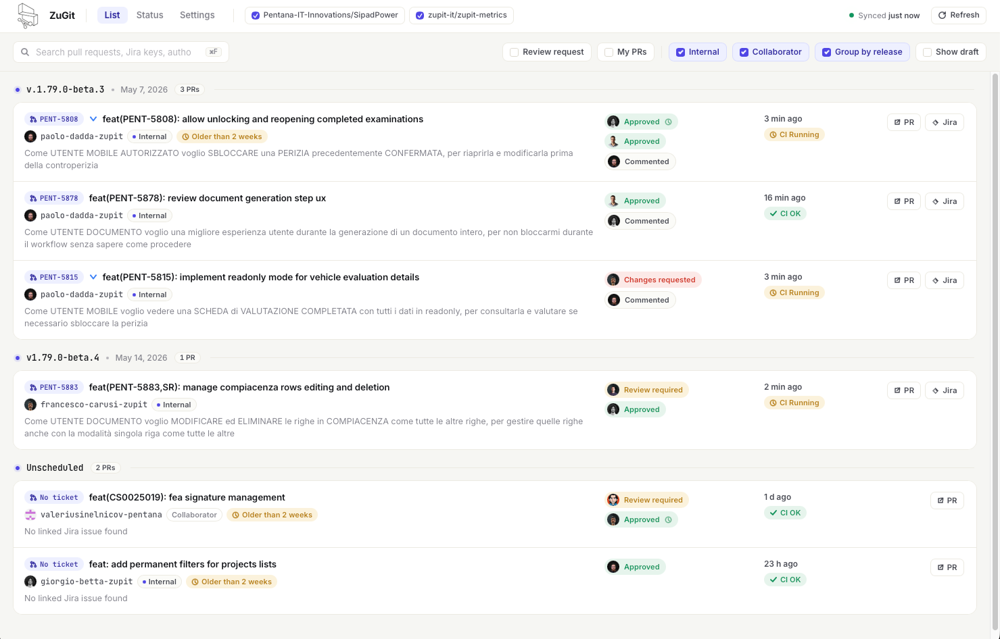

# ZuGit

A desktop app for monitoring GitHub pull requests enriched with Jira data, built with Tauri 2.

> **macOS — first launch**
> The app is not notarized. macOS will block it with a "damaged" error.
> Run this once after installation, then open normally:
> ```bash
> xattr -cr /Applications/ZuGit.app
> ```



## Features

- Live list of open PRs across multiple repositories, enriched with Jira ticket info (summary, priority, release, status)
- Review status per PR — approvals, changes requested, stale approvals, pending reviewers
- CI/CD pipeline status inline
- Filter by reviewer, author, draft state, repo, or release group
- Re-request reviews directly from the list
- Native notifications for new review requests and changes requested
- Auto-refresh on a configurable interval
- Tokens stored in the system vault (macOS Keychain, Windows Credential Manager)

## Notifications

ZuGit fires native OS notifications in two cases:

- **Review requested** — when one or more PRs are newly assigned to you for review since the last refresh (tracked by PR id, so resolving one and receiving another still triggers a notification)
- **Changes requested** — when a new reviewer requests changes on one of your PRs

Notifications are skipped on the first load to avoid a burst on startup, and can be disabled entirely from Settings. Each refresh resets the auto-refresh timer, so manually triggering a refresh does not cause double-firing.

## How it fetches data

On each refresh, ZuGit sends a single GraphQL query per repository to the GitHub API.
Each query returns all open PRs with reviews, CI status, additions/deletions, and assignees in one round trip.
Stale entries (closed or merged PRs) are evicted automatically.

Jira tickets are fetched in bulk once per refresh and cached in memory for the same session.
The cache is cleared entirely only when settings are saved.

## Token security

Tokens are never written to disk in plain text. On save, ZuGit attempts to store them in the system vault:

- **macOS** — macOS Keychain via the `security` CLI
- **Windows** — Windows Credential Manager via the `keyring` crate
- **Fallback** — if the system vault is unavailable, tokens are encrypted with DPAPI (Windows) before being written to the settings file in the app data folder. The Status tab shows which backend is active and whether the last save reached the vault.

## Privacy

ZuGit is fully local. All API calls go directly from your machine to GitHub and Jira — there is no intermediate server, no analytics, and no telemetry of any kind.

## Author classification

Each PR author is classified as **Internal** or **Collaborator**:

- **Internal** — the GitHub username contains the configured internal marker (default: `-zupit`)
- **Collaborator** — the username is in the explicit collaborator list, or does not match the internal marker

Both filters are configurable in Settings and used to filter the PR list.

## Jira key extraction

ZuGit extracts the Jira key from each PR in order of preference:

1. PR title, using the board prefix configured for that repository (e.g. `[PROJ-123]`)
2. PR title, any board prefix
3. Branch name or PR body (fallback)

If no key is found for an internal PR, a warning is shown in the Status tab.

## Requirements

- GitHub personal access token (classic or fine-grained, `repo` scope)
- Jira API token (optional — enables ticket enrichment)

## Development

```bash
npm install
npm run dev
```

## Build

```bash
npm run build
```

## Release

Releases are cut via the **Release** workflow on GitHub Actions (`Actions → Release → Run workflow`).

Enter the version number **without** the `v` prefix (e.g. `0.2.0`). The workflow will:

1. Bump the version in `package.json`, `src-tauri/tauri.conf.json`, and `src-tauri/Cargo.toml`
2. Commit the changes and push a `v0.2.0` tag
3. Trigger the build workflow on that tag

The build workflow compiles and packages the app for macOS (arm64 + x86\_64), Windows, and Linux, then uploads the installers to a GitHub Release.

The updater release requires the GitHub repository secrets `TAURI_SIGNING_PRIVATE_KEY`
and `TAURI_SIGNING_PRIVATE_KEY_PASSWORD`. The public key matching that private key is
stored in `src-tauri/tauri.conf.json`; Tauri generates the updater bundle signatures
and the build workflow uploads `latest.json` to the GitHub Release.
