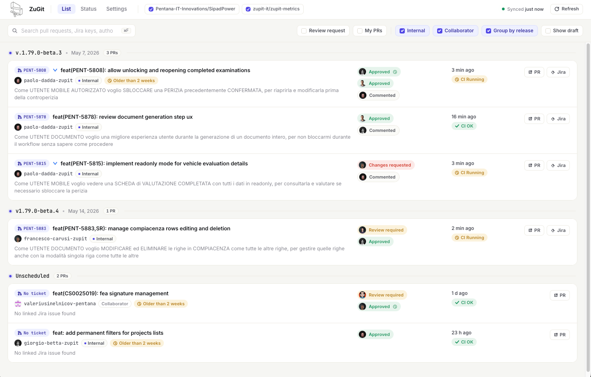

# ZuGit

A desktop app for monitoring GitHub pull requests enriched with Jira data, built with Tauri 2.

> **macOS — first launch**
> The app is not notarized. macOS will block it with a "damaged" error.
> Run this once after installation, then open normally:
> ```bash
> xattr -cr /Applications/ZuGit.app
> ```



## Features

- Live list of open PRs across multiple repositories, enriched with Jira ticket info (summary, priority, release, status)
- Review status per PR — approvals, changes requested, stale approvals, pending reviewers
- CI/CD pipeline status inline
- Filter by reviewer, author, draft state, repo, or release group
- Re-request reviews directly from the list
- Native notifications for new review requests and changes requested
- Auto-refresh on a configurable interval
- Toggl timesheet autofill — fills the free slots of your working day from the Jira stories you have in progress
- Orphan branches — remote branches with no open PR that nobody has pushed to in weeks, for cleanup
- Tokens stored in the system vault (macOS Keychain, Windows Credential Manager)

## Notifications

ZuGit fires native OS notifications in two cases:

- **Review requested** — when one or more PRs are newly assigned to you for review since the last refresh (tracked by PR id, so resolving one and receiving another still triggers a notification)
- **Changes requested** — when a new reviewer requests changes on one of your PRs

Notifications are skipped on the first load to avoid a burst on startup, and can be disabled entirely from Settings. Each refresh resets the auto-refresh timer, so manually triggering a refresh does not cause double-firing.

## How it fetches data

On each refresh, ZuGit sends a single GraphQL query per repository to the GitHub API.
Each query returns all open PRs with reviews, CI status, additions/deletions, and assignees in one round trip.
Stale entries (closed or merged PRs) are evicted automatically.

Jira tickets are fetched in bulk once per refresh and cached in memory for the same session.
The cache is cleared entirely only when settings are saved.

## Token security

Tokens are never written to disk in plain text. On save, ZuGit attempts to store them in the system vault:

- **macOS** — macOS Keychain via the `security` CLI, driven in interactive mode (`security -i`): the
  whole command goes over stdin with the value hex-encoded, so the secret never reaches `argv` —
  process arguments are readable by any other process of the same user while a command runs, which
  is why `security` itself calls `-w <value>` insecure. Hex also sidesteps interactive mode's
  space-splitting, and unlike prompting for the value it has no length limit: `readpassphrase(3)`
  truncates at 128 characters, and an Atlassian API token is around 192. Every write is verified by
  reading the value back, because `security` can exit 0 having stored something else. Non-ASCII
  secrets are refused up front: `security` prints those back as hex with no marker, so they could
  not be read again reliably
- **Windows** — Windows Credential Manager via the `keyring` crate
- **Fallback** — if the system vault is unavailable, tokens are encrypted with DPAPI (Windows) before being written to the settings file in the app data folder. The Status tab shows which backend is active and whether the last save reached the vault.

## Privacy

ZuGit is fully local. All API calls go directly from your machine to GitHub and Jira — there is no intermediate server, no analytics, and no telemetry of any kind.

## Add PR — branch detection

The "Add PR" button finds your most recently pushed branch that has no open PR yet.
Detection uses the [GitHub Activity API](docs/github-identity.md) (`GET /repos/{repo}/activity?actor={login}`) rather than git commit authorship — see [`docs/github-identity.md`](docs/github-identity.md) for why the two are not the same thing.

### API calls — New PR flow

When the card opens, ZuGit makes **4 round trips** regardless of how many repos are configured (N):

| Round trip | Call | Why |
|---|---|---|
| 1 | GraphQL `{ viewer { login } r0: repository { defaultBranchRef pullRequests(states:OPEN) { headRefName } } … }` | Viewer login + default branch + all open PR head refs per repo, batched. The open head refs are used immediately to exclude branches that already have a PR (including drafts) before spending round trips on them. |
| 2 | N × `GET /repos/{repo}/activity?actor={login}&time_period=month&per_page=25` | Push events per repo, all in parallel. The Activity API has no GraphQL equivalent. Used to find branches the viewer recently pushed to — these are the candidates for a new PR. |
| 3 | GraphQL `{ r0: repository { c0_prs: pullRequests(headRefName:…) c0_ref: ref(…) … } }` | Secondary PR existence check + latest commit headline for all remaining candidates, batched. Guards against branches not caught by round trip 1 (e.g. closed PRs on the same branch, which would make it a valid candidate again). |
| 4 | `GET /repos/{repo}/compare/{base}…{head}` | Diff stats (additions, deletions, files, commit list) for the chosen branch. Fetched last because we only need it for the one winner. |

> **Improvement area** — round trip 2 fetches at most 25 push events per repo. If a developer has more than 25 recent pushes on the same repo all without an open PR, the correct branch could be missed. Could be improved by paginating further or by using a smarter ranking strategy.

### API calls — Promote flow

When the Promote button is clicked on a draft PR row, all data (title, body, reviewers, branches) is already in the dashboard snapshot. ZuGit makes a single additional call:

| # | Endpoint | Notes |
|---|---|---|
| 1 | `GET /repos/{repo}/compare/{base}…{head}` | Diff stats, fetched async after the card renders |

## Author classification

Each PR author is classified as **Internal** or **Collaborator**:

- **Internal** — the GitHub username contains the configured internal marker (default: `-zupit`)
- **Collaborator** — the username is in the explicit collaborator list, or does not match the internal marker

Both filters are configurable in Settings and used to filter the PR list.

## Jira key extraction

ZuGit extracts the Jira key from each PR in order of preference:

1. PR title, using the board prefix configured for that repository (e.g. `[PROJ-123]`)
2. PR title, any board prefix
3. Branch name or PR body (fallback)

If no key is found for an internal PR, a warning is shown in the Status tab.

## Jira integration

ZuGit integrates with Jira in two ways: **read-only enrichment** (ticket data shown in the PR list) and **write-back actions** (checklist updates and workflow transitions triggered on publish).

### Ticket enrichment

On each refresh ZuGit issues a single bulk JQL query (`POST /rest/api/3/search/jql`) for all Jira keys found in the current PR list, then caches the results in memory for the session. Fields fetched: `summary`, `priority`, `status`, `fixVersions`, `assignee`.

If the tenant does not support the `/jql` endpoint (older Jira Server versions), ZuGit falls back to individual `GET /rest/api/3/issue/{key}` calls automatically.

Release diff scope and tag-window rules are documented in [docs/release-diff.md](docs/release-diff.md).

### Checklist (Herocoders Smart Checklist for Jira)

ZuGit reads and writes acceptance-criteria checklists managed by the **Herocoders Smart Checklist for Jira** plugin.

#### Field discovery

The writable checklist field is discovered once per session via `GET /rest/api/3/field` and cached. Herocoders exposes several fields with "checklist" in the name; ZuGit selects the correct one in priority order:

1. A field named exactly **"Checklist Text"**
2. Any field whose name contains "text" but not "view"
3. Any field that does not contain "view"

The typical field IDs on a Herocoders installation are:

| Field name | Notes |
|---|---|
| `Checklist Text` | **Writable** — the field ZuGit reads and writes |
| `Checklist Text (view-only)` | Read-only computed copy, do not write to this |
| `Checklist Progress %` | Numeric, managed by Herocoders |
| `Checklist Progress` | `x/y` string, managed by Herocoders |
| `Checklist Completed` | Boolean, managed by Herocoders |
| `Checklist Template` | Template source |
| `Checklist Content YAML` | Internal YAML, managed by Herocoders |

#### Field format — ADF + Herocoders syntax

The **Checklist Text** field uses Jira's Atlassian Document Format (ADF). Herocoders encodes checklists inside ADF as:

- `orderedList` nodes → section headers (e.g. `# Default checklist`)
- `bulletList` nodes → checklist items, with the status keyword embedded in the text

Item status keywords:

| Keyword | Meaning |
|---|---|
| `[open]` | Item not completed |
| `[done]` | Item completed |

Example raw text reconstructed from ADF:

```
# Default checklist

* [open] acceptance criterion one
* [done] acceptance criterion two
```

When **writing** back, ZuGit serialises the items as plain text (`* [done] …` / `* [open] …`) wrapped in an ADF paragraph node. Herocoders processes this and converts it into the proper list structure on its side.

#### Workflow

**Opening a draft PR** — if the branch name contains a Jira key (e.g. `PROJ-123/my-feature`), ZuGit fetches the checklist before showing the New PR card. Items can be checked/unchecked in the UI. On publish:

- **Draft PR** — the current checked/unchecked state is written back to Jira (`update_jira_checklist`). No workflow transition is applied.
- **Ready PR** — all items are marked `[done]` and written back, then ZuGit attempts the configured workflow transition (default: `MERGE REQUEST`).

**Promoting a draft PR** — the Promote button on a draft PR row opens the same card pre-filled with the existing title, body, and reviewers. The checklist is fetched fresh from Jira. On publish the same ready-PR flow applies.

#### Transition timing

Herocoders applies a workflow validator that checks its internal checklist state before allowing the transition. Because Herocoders processes the field write asynchronously, ZuGit waits **1 second** after the write before attempting the transition, and retries once more after **5 seconds** if the validator still blocks. Any other error (non-checklist 400, network error, transition not found) is surfaced immediately without retrying.

#### Configuring the transition name

The target workflow transition is configurable in Settings → **Jira merge transition** (default: `MERGE REQUEST`). The name is matched case-insensitively against the transitions returned by `GET /rest/api/3/issue/{key}/transitions`.

## Toggl integration

Optional, off by default. Enable it in Settings → **Toggl** and the toolbar grows a **Toggl** button
that opens the day planner.

### What it does

For the chosen day (today by default) ZuGit:

1. reads the time entries you already have inside the working range (default `08:00–14:00`);
2. computes the **free slots** — the parts of the range not already booked. Existing entries are
   snapped outwards to the rounding grid, so a generated entry can never bite into one of them;
3. fetches the Jira stories assigned to you in **In Progress** or in the merge-request status
   (the same `jiraMergeTransition` used elsewhere), restricted to the **open sprint**, together with
   the timestamp of their last status change, read from the issue changelog. One query per status —
   the stage comes from the query that matched, not from the status name, because Jira returns those
   localised ("In corso" cannot be pattern-matched against "In Progress"). The sprint filter is
   dropped, with a warning in the panel, if the tenant has no `sprint` field or nothing is in the
   open sprint;
4. turns each story into an *activity window*: a story that moved **into** In Progress at 10:30 was
   picked up then, so it only covers the day after 10:30; one that moved **into** the merge-request
   status at 10:30 covers the day before it. Transitions from earlier days cover the whole range;
5. assigns every free slot to the most plausible story. A transition that happened **today** is the
   strongest signal, so the story you moved to merge request at 11:00 gets the morning even if
   another one has been in progress for days; within the same day, In Progress wins over merge
   request. A slot no window covers — the whole afternoon, when the only story of the day went to
   merge request in the morning — falls back to the story worked on just before it, so a day with
   nothing In Progress is still filled. When two stories are equally plausible for the same slot the
   row asks which one to track, with a **Split between N** button that shares the slot between them;
6. fills project, tags and the **billable** flag from your own history (see below).

Nothing is written until you press **Create in Toggl**. Rows are editable (time, description, project,
tags), overlapping rows block the submit, and after a successful run the day is re-read — so the new
entries show up as "already on Toggl" and a second run proposes nothing.

### The end-of-day reminder

Once the working range is over, ZuGit sends a native notification ("Ricordati di compilare Toggl")
and opens the planner for a check. It fires at most once a day, only on working days, and only when
Toggl is configured — the notification also respects the global notifications toggle. Opening the app
at 17:00 on a day it never fired still triggers it: the timesheet is still unfilled, which is the
point. It never reopens over a planner you already have open, so rows being edited are safe.

The **Toggl** button in the toolbar appears only when the integration is enabled *and* a token is
saved: without one the panel could only show an error.

### What it can and cannot touch

The integration only ever **creates** entries: the Toggl client has a single write call
(`POST .../time_entries`) and no update or delete path, so existing history cannot be edited or
removed by ZuGit. Writes land only in the free slots of the day selected in the panel, which is
today by default and cannot go further back than 7 days (`MAX_BACKFILL_DAYS`) or into the future.
The 60-day history window is read-only — it feeds the mapping rules and nothing else.

Entries are fetched with 12 hours of margin around the working range because the Toggl query filters
on the entry *start*: a meeting that began at 07:00 and ran to 09:00 would otherwise be invisible and
its slot double-booked. Only the entries that actually overlap the range are listed in the panel.

### Project and tag mapping

On first use (and weekly after that) ZuGit reads the last N days of your Toggl entries (default 60,
capped at 90 by the API) and learns:

- **Jira key → project**, plus the exact wording you used for that story;
- **key prefix → project** (e.g. every `PENT-*` goes to one project), for stories never booked before;
- **recurring meetings** — entries without a Jira key seen at least twice (retro, stime, daily…),
  with the tags you normally attach. They appear as chips in the panel footer, one click to add, and
  they are what calendar events are matched against.

The tag is picked from a dropdown of everything the workspace knows about (plus anything seen in
history) — one tag per entry, the shape the history shows — and **billable** follows the majority of
past entries for that story or meeting.

A tag is only replayed if it was used on at least half of the past entries for that key, so a one-off
tag doesn't stick. Choices you make by hand are folded back into the rules, so tomorrow they come
pre-filled. The rules live in `toggl-rules.json` in the app data folder and carry a version stamp: when a ZuGit
release learns a new field (as `billable` did), rules cached under the old version are re-learned
automatically on the next open. The ⟳ button in the panel header forces a re-read at any time, and
the footer shows when the mapping was last learned.

### Calendar events

Toggl's own Google Calendar suggestions are not exposed by its public API, so ZuGit reads the
calendar directly from Google instead (optional, Settings → **Google Calendar**).

Events inside the working range become rows of their own, and claim their slots before the stories
are placed — a meeting is never overwritten by "work on PENT-123". Their project, tags and billable
flag come from the recurring rule that matches the event title, so the retro on your calendar lands
on the project and tags you always give it. Dropped without asking: declined invitations, all-day
entries, events marked *free* rather than busy, Google's synthetic "working location" entries, and
any event whose slot is already covered by a Toggl entry (that one is tracked already).

Setup, once:

1. In the Google Cloud console create an OAuth client (Desktop app or Web application) and enable the
   Google Calendar API.
2. Only for a **Web application** client: add `http://127.0.0.1:43117` to the authorised redirect
   URIs — Settings shows the exact string. A **Desktop app** client needs nothing: Google accepts
   loopback redirects for those on its own, and the console has no field for them.
3. Paste client id and secret into Settings, save, then press **Collega account**. ZuGit opens the
   consent page in your browser, catches the redirect on that loopback port, and keeps only the
   refresh token, in the system keychain.

The requested scope is `calendar.readonly`: ZuGit can list events and nothing else. The authorisation
code exchange uses PKCE (S256) with a random `state`, both verified before the code is used.

### API endpoints used

| Endpoint | Purpose |
| --- | --- |
| `GET /api/v9/me?with_related_data=true` | account, workspaces, projects (cached — 30 calls/hour limit) |
| `GET /api/v9/me/time_entries` | entries for the day, and the history window for learning |
| `POST /api/v9/workspaces/{id}/time_entries` | entry creation, one at a time |
| `GET /calendar/v3/calendars/{id}/events` | calendar meetings for the day (read-only) |

## Orphan branches

Off by default: enable **Orphan branches** in Settings and a tab appears next to *Status*.

The scan covers the repositories the toolbar's **repositories selected** dropdown keeps visible — the
same scope as the PR list, not every repository in Settings. Changing the selection while the tab is
open rescans; deselecting them all says so instead of showing an empty list.

A branch is listed when **all** of these hold:

- it is not the repository's default branch, and has no branch protection rule
- it is neither the head nor the base of an open PR
- its name does not start with one of the **Ignored branch prefixes** (`release` out of the box —
  release branches are long-lived by convention, not by protection rule). One prefix per line, the
  match is case-insensitive on the start of the name
- its last commit is older than the **Stale after** threshold (15 days by default, 7–365 allowed)

Branches whose PR was merged are not a special case — they are simply gone if the repository deletes
them on merge, and listed like any other otherwise.

The list is sorted ascending by last commit — the most stale branch first. **Group by author** breaks
it into one section per person, each headed by the branch count and the age of that person's oldest
branch; groups keep the same ordering, so whoever owns the oldest branch comes first.

The **Only mine** filter matches branches whose *last commit* is yours. GitHub records no creator for
a ref, so this is the only ownership information available; a branch you started and someone else
last pushed to counts as theirs — and the same rule decides which group a branch lands in.

**Internal** (on by default) and **Collaborator** filter by who that author is. Unlike the PR list,
which splits three ways, this view splits two: *internal* is any login matching the internal marker
**or** listed among the team members, *collaborator* is everyone else — including commits with no
linked GitHub account, since an unlinked commit has no login to match. At least one of the two stays
ticked: unticking both would show an empty list that reads like "nothing to clean up".

The view is read-only. A row opens the branch on GitHub — ZuGit never deletes a ref.

### Cost

Two paginated GraphQL queries per repository: the open PRs' head and base refs, then the branch refs
themselves (100 per page, oldest commit first, stopping at the first page that reaches recent
branches — capped at 20 pages). That is why the scan runs on demand — opening the tab, or **Rescan**
— and never on the auto-refresh. The result is kept for the session, so switching tabs is free; it is
dropped only when the repository selection changes, which makes it wrong rather than merely old.

Repositories that fail to scan are listed as warnings above the results; the others still render.

## What's new modal

Two separate things, on purpose:

- The **What's new** modal (shown once after an update, and from the nav entry) is curated by hand in
  the `VERSIONS` array of [`src/changelog.ts`](src/changelog.ts), with optional screenshots per
  entry. It is what a user should read about a release — not every fix and internal change.
- [`CHANGELOG.md`](CHANGELOG.md) is the full record, for whoever works on the app.

When an update is available, the badge in the toolbar opens the **release notes published with the
incoming version** with *Install and restart* or *Later*.

## Requirements

- GitHub personal access token (classic or fine-grained, `repo` scope)
- Jira API token (optional — enables ticket enrichment)
- Toggl Track API token (optional — enables the timesheet autofill; found in your Toggl profile page)
- Google OAuth client id + secret (optional — enables the calendar import)

## Development

```bash
npm install
npm run dev
```

## Build

```bash
npm run build
```

## Release

Releases are cut via the **Release** workflow on GitHub Actions (`Actions → Release → Run workflow`).

Enter the version number **without** the `v` prefix (e.g. `0.2.0`). The workflow will:

1. Bump the version in `package.json`, `src-tauri/tauri.conf.json`, and `src-tauri/Cargo.toml`
2. Commit the changes and push a `v0.2.0` tag
3. Trigger the build workflow on that tag

The build workflow compiles and packages the app for macOS (arm64 + x86\_64), Windows, and Linux, then uploads the installers to a GitHub Release.

The updater release requires the GitHub repository secrets `TAURI_SIGNING_PRIVATE_KEY`
and `TAURI_SIGNING_PRIVATE_KEY_PASSWORD`. The public key matching that private key is
stored in `src-tauri/tauri.conf.json`; Tauri generates the updater bundle signatures
and the build workflow uploads `latest.json` to the GitHub Release.
